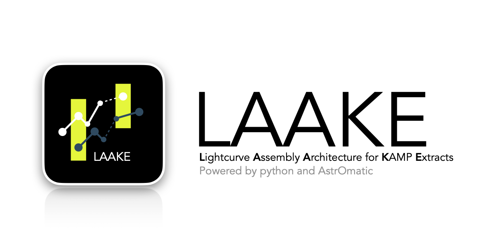

        =============================================================
             __           ____       ____     __   ___   ________
            |  |         /    \     /    \   |  | /  /  |   _____|
            |  |        /  /\  \   /  /\  \  |  |/  /   |  |_____
            |  |       |  /__\  | |  /__\  | |      \   |   _____|
            |  |_____  |   __   | |   __   | |  |\   \  |  |_____
            |________| |__|  |__| |__|  |__| |__| \___\ |________|
            Lightcurve  Assembly Architecture for KAMP   Extracts
        =============================================================

# LAAKE

Lightcurve Assembly Architecture for KAMP Extracts (LAAKE) is a AstrOmatic powered and python based data processing pipeline specifically designed for KMTNet AGN Monitoring Program (KAMP), which utilizes Korea Microlensing Telescope Network (KMTNet) to generate light curves of 500+ AGNs (Active Galactic Nuclei) in the Southern Hemisphere. 

## Installation

You must have working installations for:

- [SExtractor](https://www.astromatic.net/software/sextractor/) (Bertin & Arnouts 1996): AstrOmatic SW for source extraction.
- [SWarp](http://www.astromatic.net/software/swarp) (Bertin et al. 2002): AstrOmatic SW for image resampling.
- [SCAMP](https://www.astromatic.net/software/scamp/) (Bertin 2006): AstrOmatic SW for astrometric and photometric calibration.
- [fpack](https://heasarc.gsfc.nasa.gov/fitsio/fpack/) (Pence et al. 2010): Compressing FITS images.

Install the latest development version:
```
git clone https://github.com/ericjsh/LAAKE.git
```

Resolve environment:
```
conda env create --file environment.yaml
conda activate LAAKE
```

## CLI

```
        python laake.py                         

        =============================================================
             __           ____       ____     __   ___   ________
            |  |         /    \     /    \   |  | /  /  |   _____|
            |  |        /  /\  \   /  /\  \  |  |/  /   |  |_____
            |  |       |  /__\  | |  /__\  | |      \   |   _____|
            |  |_____  |   __   | |   __   | |  |\   \  |  |_____
            |________| |__|  |__| |__|  |__| |__| \___\ |________|
            Lightcurve  Assembly Architecture for KAMP   Extracts
        =============================================================
        LAAKE ver 1.1.0
    
        Written by Sungho JUNG <eric2912@snu.ac.kr>
            
        visit https://congruous-value-af8.notion.site/LAAKE-12c48de1964b80e09902ce791bc1d833?pvs=4
            
        > SYNTAX python laake.py [-h] [-v | -e | -g | -r] [-f FIELD] [-y YEAR] [-b BAND] [-t TEL]
        > to show help: python laake.py -h
        > example command: python laake.py -r
```


Visit Notion webpage (https://congruous-value-af8.notion.site/LAAKE-12c48de1964b80e09902ce791bc1d833) for tutorial on running data process and/or reading output files
